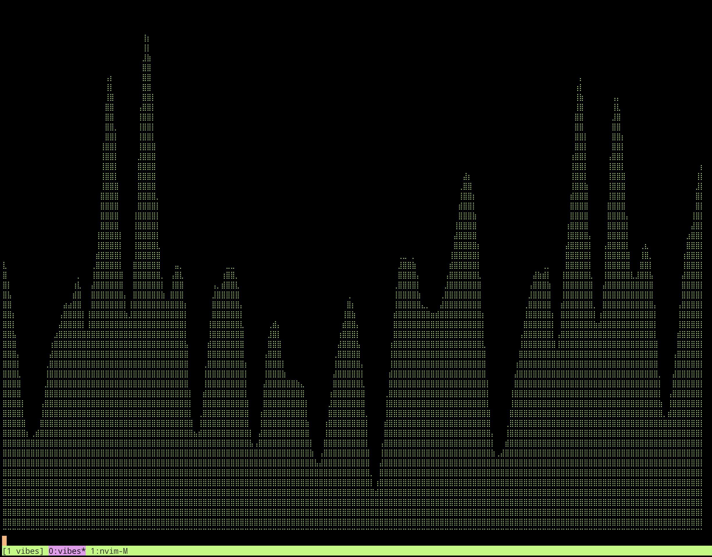

# Vibes

A terminal audio visualizer written in Rust

## Description

Uses your device microphone to listen to music or sound in the environment.  
Displays a wave visualisation in the terminal responding to the sound data.

